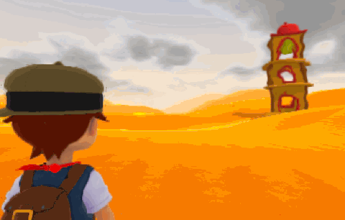
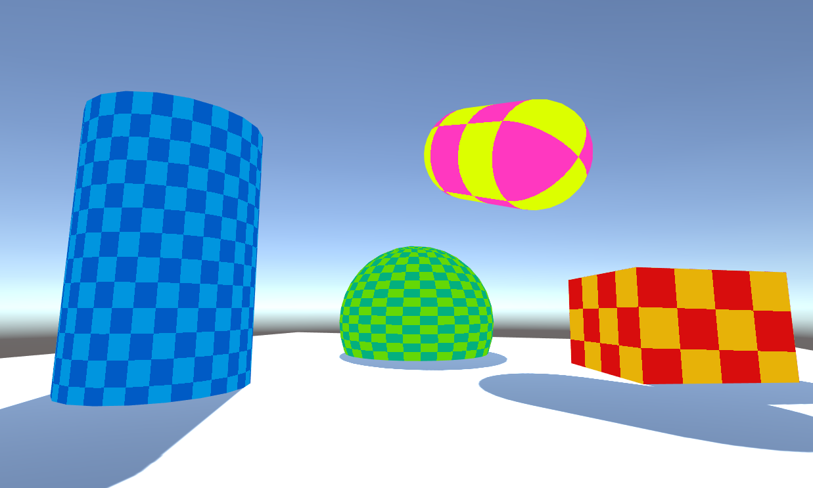
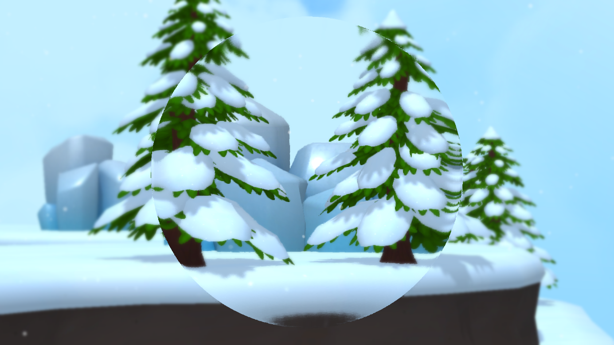

# Shaders
A collection of shaders written in CG/ShaderLab for Unity used in the development of Poi.

BetterTransparentDiffuse.shader
------
The default Unity shader for transparent objects suffers from some overlapping issues on complex objects (as seen on the left). This shader fixes the problem by rendering the object in two passes (as seen on the right). The center opaque image is for reference.   
")

Silhouette.shader
------
This simple two-pass shader renders a silhouette on top of all other geometry when occluded. We used this effect in Poi for objects that weren't marked as camera occluders so players would always be able to see the character.   

Stipple.shader
------
This inexpensive screen-door transparency technique is useful for distance culling when traditional transparency is either too expensive or produces artifacts due to depth sorting. We used this on Poi to cull enemies when optimizing for lower-end hardware, specifically the Nintendo Switch.   

HeatHaze.shader
------
We achieved this depth-aware heat haze effect in Poi by attaching this shader to a geosphere with inverted normals as a child of the primary game camera. This allowed us to easily animate the effect based on distance and didn't interfere with other post processing effects.   

Checkerboard.shader
------
A basic shader to render a two-colored checkerboard pattern using the existing vertex UV coords.    

DiffuseTwoSided.shader
------
For rendering both sides of an object. For example if it's non-convex or an animated plane used for a flag/cloth, etc.    

ScreenDistortion.shader
------
This image effect takes a normal map as input and applies it to the screen as a post-process. The normal map will always be centered and scaled appropriately independent of aspect ratio and window resolution. We used this effect for the telescope item in Poi, but it would also work great for sniper scopes, etc.   

")
