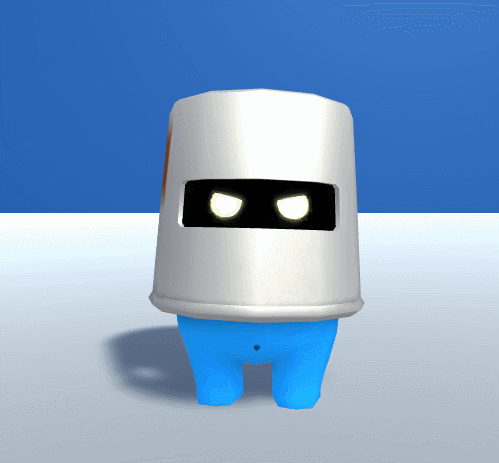

# Shaders
A collection of shaders written in CG/ShaderLab for Unity used in the development of Poi.

BetterTransparentDiffuse.shader
------
The default Unity shader for transparent objects suffers from some overlapping issues on complex objects (as seen on the left). This shader fixes the problem by rendering the object in two passes (as seen on the right). The center opaque image is for reference.   
")

Silhouette.shader
------
This simple two-pass shader renders a silhouette on top of all other geometry when occluded. We used this effect in Poi for objects that weren't marked as camera occluders so players would always be able to see the character.   

Stipple.shader
------
This cheap screen-door technique is useful for distance culling as it avoids traditional transparency sorting issues. Also useful if you need the extra performance.   

Checkerboard.shader
------
A basic shader to render a two-colored checkerboard pattern using the existing vertex UV coords.    

DiffuseTwoSided.shader
------
For rendering both sides of an object. For example if it's non-convex or an animated plane used for a flag/cloth, etc.    

ScreenDistortion.shader
------
This image effect takes a normal map as input and applies it to the screen as a post-process. The normal map will always be centered and scaled appropriately independent of aspect ratio and window resolution. We used this effect for the telescope item in Poi, but it would also work great for sniper scopes, etc.   

")
